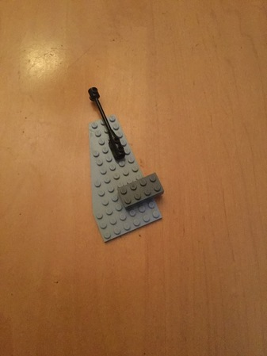

#  Deep-Learned Lego Perception Pipeline

A three stage mess of a project for generating 3D models of Lego combinations from images.  The first stage uses a retrained Mask R-CNN model to extract 
masks for each piece in the image. The second stage uses known 2D-3D correspondences with a pnp solver (OpenCV) to estimate poses for each piece.  The third stage refines the pose estimates.  

The particular use case I had in mind was building some kind of simple fighter craft and flying the generated 3D model ingame.  The four pieces this primitve version uses are various x by x bricks, left-right versions of a basic wing piece, an engine type piece, and a pole for weapons.

See this <a href="https://github.com/WHSnyder/LegoTrainingRenderer">repo</a> for training data details...

## Stages and their challenges

Far too many to list here when it comes to my lack of general CV/DL experience and trouble digesting research papers... 

* First stage  

	      
	
	* Training data has frequent abnormalities such as pieces lying half off-screen or extreme occlusion.  In such cases a wing could be hidden entirely with the exception of a 2x2 region of studs.  If this wing is viewed from directly above, it will be indistinguishable from a 2x2 brick piece. The network will be forced to make the wrong choice given the infomation at hand.
	* The network is relatively accurate with real images of pieces, though struggles consistently with black pieces and differing resolutions.

	  

* Second stage

	*  For tracking purposes, a tiny Unet produces highlights for studs present in the image.  This is useful for tracking purposes, since neighboring studs can be plugged into a RANSAC solver for camera localization.

	

	*  A larger Unet generates local geometry mappings for the pieces present in the image.  These local coordinates are plugged into OpenCV's RANSAC solver.  This method works reliably for most pieces with distinct features, but fails more often with flat, uniformly studded pieces like wings.  Fine tuning this network while trying to expand piece coverage is tricky.  It's very likely that it'll be used to refine pointclouds from world space to Lego voxels instead of directly estimating pose in future iterations.  Not to mention, it cannot handle heavily occluded bricks, something I was hoping it would magically accomplish.

	

* Third stage 

	* Studs and insets are brute-force matched with one another to find likely fits between nearby pieces. A lazy solution that works well enough for now.

## Future directions

* Perfecting Stage 2

* After spending most of October surveying papers on SotA pose estimation algorithms/networks I figured estimating explicit 2D-3D correspondence would be the most realistic approach.  Fully deep-learned pose estimation pipelines such as <a href="https://github.com/dineshreddy91/Occlusion_Net">OcclusionNet</a> or <a href="https://github.com/yuxng/PoseCNN">PoseCNN</a> were far too bulky/confusing to work with and lighter networks such as KeypointNet didn't seem robust enough to heavy occlusion/textureless surfaces.  In the near future I would love to experiment with estimating dense correspondence with some kind of hierarchical FCN approach or a graph-based model as seen in OcclusionNet.  

* Multi-view approaches

* Exploring structure-from-motion techniques and integration with deep learning strategies. 

* A reinforcement learning guess-rerender-refine approach to pose estimation or an iterative model as in this <a href="https://arxiv.org/pdf/1507.06550.pdf">human pose estimation method.</a> 

* An approach requiring a network to learn a general voxelization for the combination presented.  The network would be trained to estimate each piece's rotation and translation in terms of another piece's voxelization-derived coordinate system.  Perhaps an convolutional encoder-decoder + recurrent architecture similar to that of image captioning networks could work in such a system. 

* I don't have any formal training or coursework in machine learning for computer vision so I could be wrong, but from my research it seems like a fully deep-learned pipeline encompassing all 3 stages would be impractical.  The need for fuzzy logic followed by structured 3D reasoning suggests a very convoluted design and painful design iteration times.  Pieces can be completely unique or could have modular similarity to one another ie: 2 2x2 bricks make a 4x2 brick.  Trying to train a network to accommodate these fundemental structural differences seems wrong... 

* Learning about deep learning more deeply.
